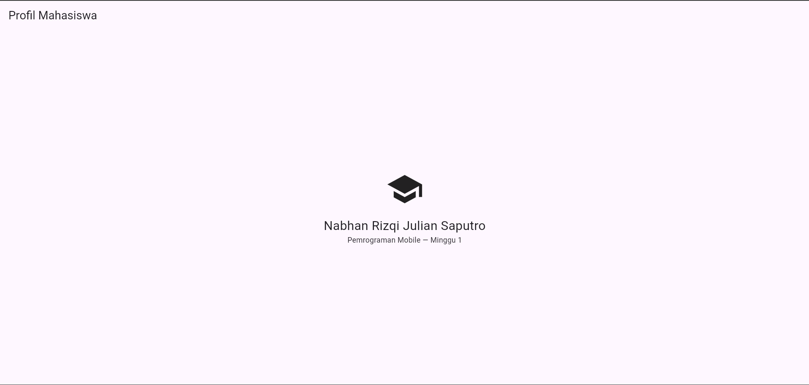
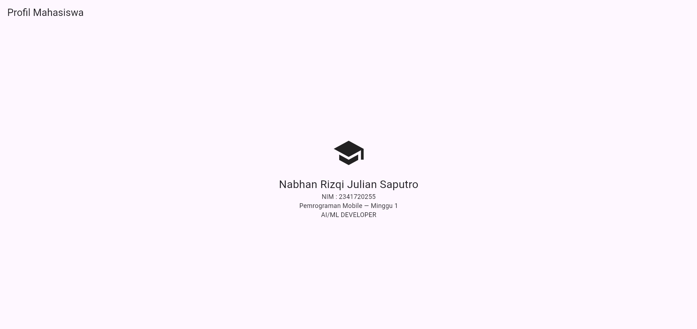

# Laporan Praktikum Minggu 1: Mobile Development Ecosystem & Flutter Refresh

---

## 👤 Informasi Mahasiswa & Mata Kuliah

| Data Mahasiswa           | Keterangan                                          |
| :----------------------- | :-------------------------------------------------- |
| **Mata Kuliah**    | Pemrograman Mobile                                  |
| **Dosen Pengampu** | Agung Nugroho Pramudhita S.T .M.T                   |
| **Nama Mahasiswa** | Nabhan Rizqi Julian Saputro                         |
| **NIM**            | `2341720255`                                      |
| **Kelas**          | D-IV Teknik Informatika                             |
| **Minggu / Modul** | Minggu 01 - Mobile Ecosystem & Dart/Flutter Refresh |

---

## 🎯 1. Tujuan Praktikum / Modul

1. **Memahami Ekosistem Pengembangan Mobile**: Mengenal alur kerja Flutter SDK, Android Toolchain, serta konfigurasi environment.
2. **Refresh Sintaks Bahasa Dart**: Mengingat kembali dasar pemrograman Dart (variabel, tipe data, control flow, functions, OOP).
3. **Mengenal Hirarki Widget Flutter**: Memahami konsep *Everything is a Widget*, dasar *declarative UI*, serta widget layout (`Scaffold`, `Column`, `Row`, `Card`, `Container`).

---

## 🚀 2. Fitur Utama & Tugas (Mini Assignment)

- **Kartu Identitas Mahasiswa**:

  - Menampilkan data diri: **Nama Lengkap**, **NIM**, **Program Studi**, **Jurusan**, **Kampus/Institusi**, dan **Status Akademik**.
- **Badge NIM Kustom**: Menggunakan `Container` dengan dekorasi radius dan warna untuk penegasan identitas visual.
- **Latihan Dasar Dart**:

  - [`lib/dart_refresh.dart`](./lib/dart_refresh.dart): Refresh sintaks dasar Dart.
  - [`lib/hitungLuasPersegiPanjang.dart`](./lib/hitungLuasPersegiPanjang.dart): Program perhitungan matematis berbasis fungsi Dart.

---

## ⚠️ 3. Kendala Teknis & Solusi

### 1. Lisensi Android SDK (*Android license status unknown*)

- **Deskripsi Masalah**: Saat awal menjalankan `flutter doctor`, muncul peringatan pada Android Toolchain bahwa *Android license status unknown* yang menghambat proses build ke emulator/perangkat Android.
- **Penyebab**: Komponen CLI tools Android SDK belum menerima dan menandatangani *license agreement* resmi dari Google.

# screenshots hasil

<pre class="vditor-reset" placeholder="" contenteditable="true" spellcheck="false">
</pre>
