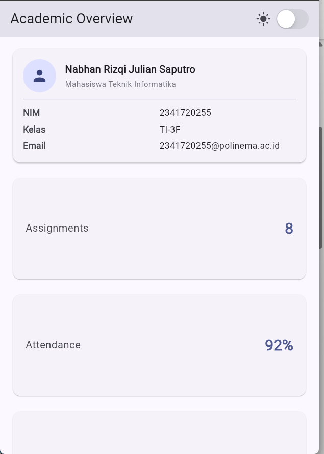
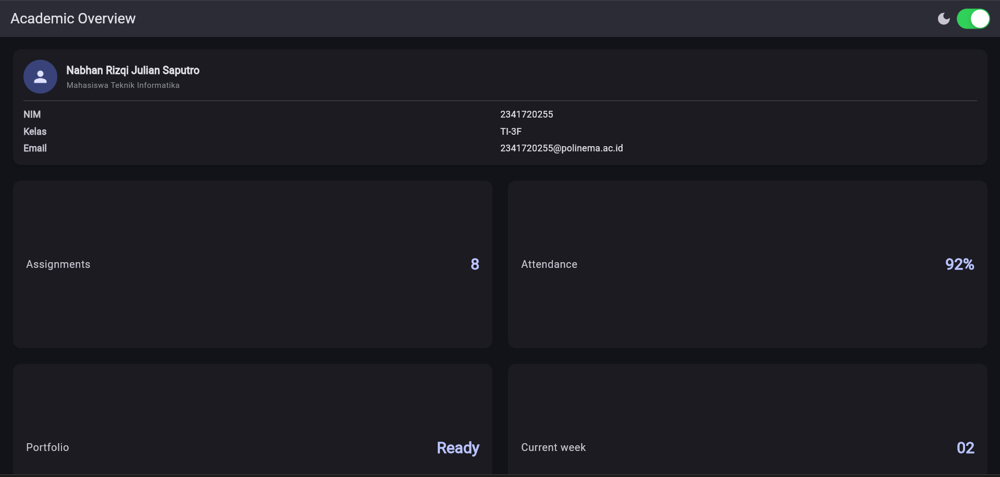

# Laporan Praktikum Minggu 2: Declarative UI & Responsive Design (Academic Overview)

---

## 👤 Informasi Mahasiswa & Mata Kuliah

| Data Mahasiswa           | Keterangan                                     |
| :----------------------- | :--------------------------------------------- |
| **Mata Kuliah**    | Pemrograman Mobile                             |
| **Dosen Pengampu** | Agung Nugroho Pramudhita S.T .M.T              |
| **Nama Mahasiswa** | Nabhan Rizqi Julian Saputro                    |
| **NIM**            | `2341720255`                                 |
| **Kelas**          | D-IV Teknik Informatika (TI-3F)                |
| **Minggu / Modul** | Minggu 02 - Declarative UI & Responsive Design |

---

## 🎯 1. Tujuan Praktikum / Modul

1. **Memahami Paradigma Declarative UI**: Memahami bagaimana UI direkonstruksi secara reaktif berbasis perubahan *state* (`setState`, *theme mode switching*).
2. **Penguasaan Widget Layout Inti**: Mengimplementasikan `Row`, `Column`, `Expanded`, `Flexible`, `Container`, dan `Card` secara proporsional tanpa *pixel overflow*.
3. **Desain Responsif Adaptif**: Menggunakan `LayoutBuilder` untuk mengadaptasi jumlah kolom layout (1 kolom pada layar sempit $< 700\text{px}$, 2 kolom pada layar lebar $\ge 700\text{px}$).
4. **Dukungan Tema Dinamis**: Menyediakan integrasi *Light Theme* dan *Dark Theme* berbasis Material 3 dengan *toggle switch* (`CupertinoSwitch`).
5. **Standar Aksesibilitas (A11y)**: Mengintegrasikan `Semantics` dan `ExcludeSemantics` agar halaman ramah terhadap *Screen Reader* (TalkBack / VoiceOver).

---

## 🧠 2. Eksplorasi Desain Berbantuan AI (AI Design Exploration)

### 📌 Prompt 1: Prompt Desain (Komparasi Tata Letak)

> **Prompt:**
> *"Bandingkan dua tata letak dashboard akademik untuk Flutter: versi GridView dan versi LayoutBuilder + Column. Jelaskan trade-off responsif dan aksesibilitasnya."*

**Hasil Analisis & Perbandingan:**

| Parameter                                     | Versi`GridView` Murni                                                                                                                                                                                      | Versi`LayoutBuilder` + `Column` / Flex (Dipilih)                                                                                                                            |
| :-------------------------------------------- | :----------------------------------------------------------------------------------------------------------------------------------------------------------------------------------------------------------- | :------------------------------------------------------------------------------------------------------------------------------------------------------------------------------ |
| **Fleksibilitas Konten**                | Terikat kaku pada`childAspectRatio`. Jika ada widget heterogen (seperti Header Profil yang tinggi dan kartu metrik yang pendek), item akan terpotong atau menyisakan ruang kosong yang tidak proporsional. | Sangat fleksibel. Header profil membentang 100% (*full width*), sedangkan kartu metrik di bawahnya dapat beradaptasi mengikuti konten (*content-driven height*).            |
| **Adaptabilitas Responsif**             | Hanya mengubah`crossAxisCount` berdasarkan lebar layar, namun tinggi kartu tetap proporsional statis.                                                                                                      | Mengizinkan penyesuaian breakpoint dinamis (`constraints.maxWidth >= 700 ? 2 : 1`) sekaligus mempertahankan tata letak hirarki vertikal yang rapi.                            |
| **Aksesibilitas (A11y) & Text Scaling** | Rentan mengalami*overflow* jika pengguna memperbesar ukuran font sistem (*Large Text / Dynamic Type*), karena aspek rasio grid membatasi pertumbuhan tinggi kartu.                                       | Tinggi kartu membesar secara alami saat teks diskalakan, sehingga tidak ada teks yang terpotong untuk pengguna dengan gangguan penglihatan (*low vision*).                    |
| **Alur Baca Screen Reader**             | Pembaca layar melintasi sel grid secara berurutan tanpa pemisahan peran struktural yang jelas antara header dan metrik.                                                                                      | Memisahkan`Header` halaman secara semantik (`header: true`) dari grup metrik statistik, memberikan orientasi navigasi yang lebih baik bagi pengguna *TalkBack/VoiceOver*. |

---

### 📌 Prompt 2: Prompt Penguatan Konsep (Overflow pada Expanded di dalam Row)

> **Prompt:**
> *"Jelaskan kapan penggunaan Expanded justru menyebabkan overflow di dalam Row, beri contoh kode yang gagal dan perbaikannya."*

**Penjelasan Konseptual:**`Expanded` berfungsi memaksa *child widget* mengisi sisa ruang yang tersedia di sepanjang *main-axis* (horizontal pada `Row`). Namun, `Expanded` **justru memicu error/overflow** pada situasi berikut:

1. **Unbounded Horizontal Constraints**: Ketika `Row` diletakkan di dalam container yang lebarnya tak terhingga (misal di dalam horizontal `SingleChildScrollView` atau `ListView(scrollDirection: Axis.horizontal)`). Flutter tidak dapat menghitung sisa ruang untuk `Expanded`, memicu exception `RenderFlex children have non-zero flex but incoming width constraints are unbounded`.
2. **Fixed-width Children yang Melebihi Ruang**: Jika anak di dalam `Expanded` memiliki batas minimum intrinsik yang lebih besar dari sisa ruang layar tanpa penanganan pemotongan teks (*ellipsis/wrap*).

**Contoh Kode Gagal (Error Layout):**

```dart
// ❌ KODE GAGAL: Row dengan Expanded di dalam Horizontal Scrollable Container
SingleChildScrollView(
  scrollDirection: Axis.horizontal,
  child: Row(
    children: [
      const Icon(Icons.school),
      Expanded( // ⚠️ Crash: incoming width constraints are unbounded!
        child: Text('Program Studi D-IV Teknik Informatika Polinema'),
      ),
    ],
  ),
)
```

**Contoh Kode Perbaikan (Solutif):**

```dart
// ✅ PERBAIKAN 1: Pada layar normal (non-scrollable horizontal), batasi teks dengan ellipsis
Row(
  children: [
    const Icon(Icons.school),
    const SizedBox(width: 8),
    Expanded(
      child: Text(
        'Program Studi D-IV Teknik Informatika Polinema',
        maxLines: 1,
        overflow: TextOverflow.ellipsis,
      ),
    ),
  ],
)

// ✅ PERBAIKAN 2: Jika memang membutuhkan horizontal scrolling, gunakan Flexible / Fixed Width
SingleChildScrollView(
  scrollDirection: Axis.horizontal,
  child: Row(
    children: const [
      Icon(Icons.school),
      SizedBox(width: 8),
      Text('Program Studi D-IV Teknik Informatika Polinema'),
    ],
  ),
)
```

---

### 📌 Prompt 3: Verification Prompt (Audit AI Mandiri)

> **Prompt:**
> *"Periksa kembali rekomendasi layout di atas: apakah tetap responsif di bawah 600px, apakah mengurangi aksesibilitas, dan apakah ada widget yang tidak tersedia di Flutter stabil saat ini?"*

**Hasil Audit Verifikasi:**

1. **Responsivitas di Bawah 600px (Layar HP Kecil)**:
   - **Lolos**. Menggunakan breakpoint `< 700px` sehingga pada layar sempit (320px - 600px), sistem otomatis beralih ke format **1 kolom**.
   - Halaman dibungkus dengan `SingleChildScrollView` sehingga tidak terjadi *bottom overflow* saat orientasi layar mendatar (*landscape*) atau saat resolusi vertikal terbatas.
   - Komponen teks panjang pada email dan nama dibekali `Flexible` dan `TextOverflow.ellipsis`.
2. **Aksesibilitas (Screen Reader & Contrast)**:
   - **Lolos**. Menggunakan widget `Semantics` pada Header Judul (`header: true`), Switch Tema (`toggled`, `label`, `hint`), dan Dashboard Card (`container: true`, `label: '$title, $value'`).
   - Ikon dekoratif dibungkus `ExcludeSemantics` untuk meminimalisir redundansi suara.
   - Skema warna Material 3 (`ThemeData` dengan `colorSchemeSeed: Colors.indigo`) memastikan rasio kontras teks di atas 4.5:1 (memenuhi standar WCAG AA).
3. **Ketersediaan Widget pada Flutter Stable**:
   - **Lolos 100%**. Seluruh widget yang digunakan (`MaterialApp`, `Scaffold`, `AppBar`, `SingleChildScrollView`, `Column`, `Row`, `Expanded`, `Flexible`, `LayoutBuilder`, `GridView`, `Card`, `Container`, `CircleAvatar`, `CupertinoSwitch`, `Semantics`, `ExcludeSemantics`) merupakan widget resmi bawaan dari **Flutter Stable Channel** tanpa dependensi pihak ketiga yang berisiko usang (*deprecated*).

---

## 🏛️ 3. Keputusan Desain & Alasan Teknis

1. **Kombinasi `SingleChildScrollView` + `Column` + `LayoutBuilder`**:
   - Memisahkan komponen **Header Profil** (`ProfileCard`) agar tampil penuh di bagian atas, sementara **Kartu Metrik** disusun responsif di bawahnya.
2. **Grid Menggunakan `shrinkWrap: true` dan `NeverScrollableScrollPhysics`**:
   - Menghindari konflik *scrollable viewport* ganda di dalam `SingleChildScrollView`.
3. **Pemberian Semantics Eksplisit**:
   - Menjadikan kartu metrik (misal: "Assignments" dan "8") terbaca sebagai satu kesatuan kalimat utuh oleh pembaca layar: *"Assignments, 8"*.

---

## 🧪 4. Bukti Verifikasi & Pengujian

### A. Pengujian Otomatis (Widget Testing)

Pengujian dilakukan pada berkas [`test/widget_test.dart`](./test/widget_test.dart) dengan skenario:

1. **Uji Layar Sempit (400x800)**: Memverifikasi kartu tampil dalam 1 kolom lebar penuh.
2. **Uji Layar Lebar (1200x800)**: Memverifikasi kartu membelah menjadi 2 kolom responsif.

Hasil eksekusi:

```bash
flutter test
# Output: All tests passed!
```

---

## 📸 5. Screenshots Hasil Implementasi

|  Light Mode (1 Kolom - Layar Sempit)  |   Dark Mode (2 Kolom - Layar Lebar)   |
| :------------------------------------: | :------------------------------------: |
|  |  |

*(Catatan: Letakkan tangkapan layar pengujian pada folder `screenshots/`)*

---

## 💭 6. Refleksi Pembelajaran

### 1. Apa perbedaan cara berpikir *imperative* dan *declarative* saat membangun UI?
Perbedaan mendasar terletak pada cara pengelolaan tampilan terhadap perubahan data (*state*):
* **Imperative ($UI \leftarrow \text{mutasi manual}$)**: Pengembang secara manual menginstruksikan langkah perubahan elemen visual (seperti mengambil referensi ID lalu memanggil `setText()` atau `setVisibility()`).
* **Declarative ($UI = f(\text{state})$)**: Pengembang cukup mendeskripsikan bentuk UI untuk setiap kondisi state. Ketika state berubah via `setState()`, Flutter secara otomatis merekonstruksi widget tree yang relevan.

### 2. Kapan `Expanded` membantu dan kapan penggunaannya justru menghasilkan layout error?
`Expanded` berfungsi memaksa widget anak mengisi sisa ruang yang tersedia di sepanjang sumbu utama (*main-axis*):
* **Membantu**: Mencegah *pixel overflow* pada teks dinamis panjang di dalam `Row`/`Column` yang memiliki batas ruang pasti (*bounded constraints*).
* **Menghasilkan Error**: Ketika ditempatkan di dalam container dengan dimensi tak terbatas (*unbounded constraints*), seperti horizontal `SingleChildScrollView` atau `ListView`, karena Flutter tidak dapat menghitung pembagian ruang tak hingga ($\infty$).

### 3. Bagaimana *breakpoint* dan *theme* memengaruhi pengalaman pengguna (UX)?
Kombinasi tata letak responsif dan tema adaptif memastikan kenyamanan serta keterbacaan informasi di berbagai situasi:
* **Breakpoint (`kWideBreakpoint = 700.0`)**: Mengoptimalkan proporsi tata letak—1 kolom di layar ponsel agar konten tidak terhimpit, dan 2 kolom di tablet/desktop untuk memanfaatkan ruang layar tanpa *scrolling* berlebihan.
* **Theme (Light & Dark Mode)**: Memberikan kenyamanan visual adaptif di berbagai kondisi pencahayaan sekaligus menjaga rasio kontras teks agar tetap mudah dibaca sesuai standar WCAG AA.

### 4. Apa yang Anda verifikasi dari rekomendasi AI setelah tugas inti selesai?
Verifikasi dilakukan untuk memastikan solusi yang diberikan AI aman, efisien, dan siap pakai:
* **Constraint Layout**: Memastikan tidak ada *unbounded height/width crash* (seperti penambahan `shrinkWrap: true` dan `physics: NeverScrollableScrollPhysics()` pada GridView).
* **Aksesibilitas & Standar**: Menguji kewajaran label `Semantics` serta memastikan seluruh widget berasal dari channel resmi Flutter Stable.
* **Validasi Kode Otomatis**: Menjalankan `flutter analyze` (bebas error) dan `flutter test` (100% lolos pengujian) sebagai bukti integritas kode.


