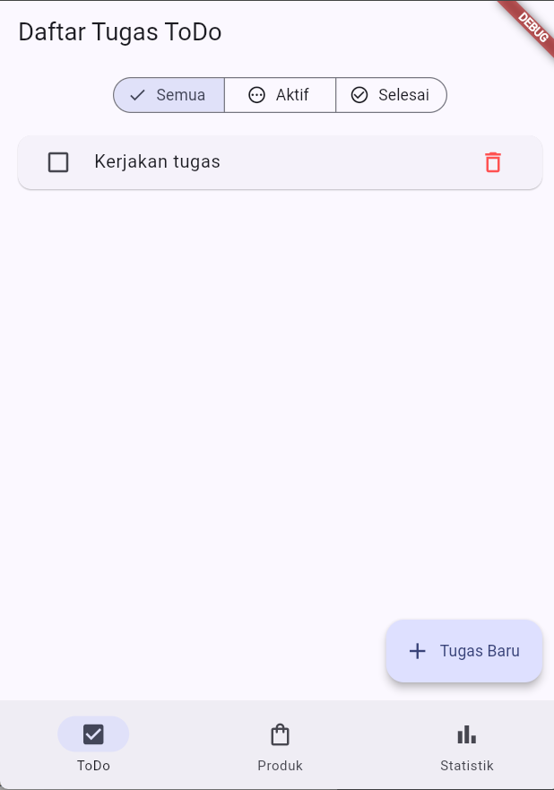
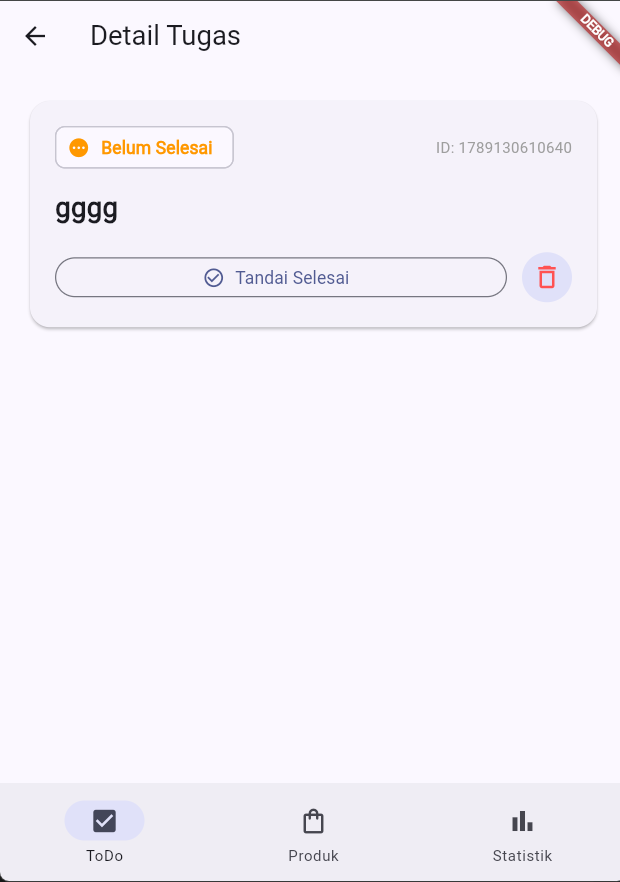
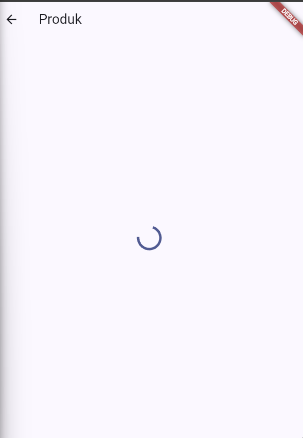
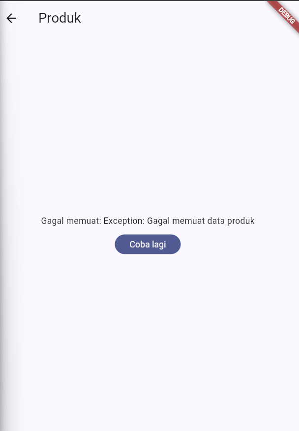
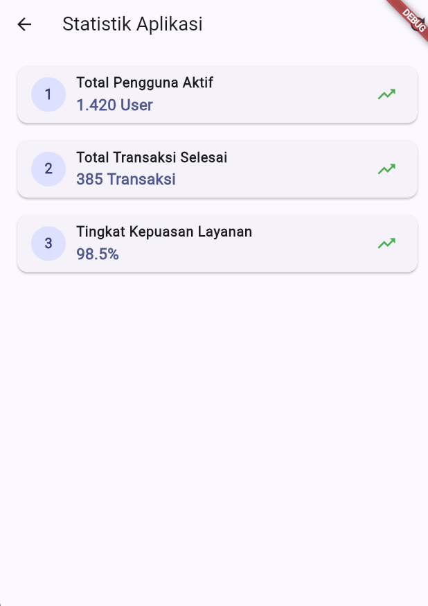

# Laporan Praktikum Minggu 3: Navigation & State Management

---

## 👤 Informasi Mahasiswa & Mata Kuliah


| Data Mahasiswa     | Keterangan                                |
| :------------------- | :------------------------------------------ |
| **Mata Kuliah**    | Pemrograman Mobile                        |
| **Dosen Pengampu** | Agung Nugroho Pramudhita, S.T., M.T.      |
| **Nama Mahasiswa** | Nabhan Rizqi Julian Saputro               |
| **NIM**            | `2341720255`                              |
| **Kelas**          | D-IV Teknik Informatika                   |
| **Minggu / Modul** | Minggu 03 - Navigation & State Management |

---

## 🎯 1. Ringkasan & Tujuan Tugas

Proyek ini merupakan aplikasi manajemen tugas (**ToDo App**) berbasis **Flutter**, yang mengintegrasikan:

1. **Navigasi Deklaratif GoRouter**: Menerapkan routing multi-page (`/`, `/detail/:id`, `/products`, `/stats`) menggunakan `StatefulShellRoute` dan `NavigationBar` persisten.
2. **State Management Riverpod**: Mengelola state reaktif dengan `Notifier`, `AsyncNotifier`, dan `Provider` turunan (*derived state*).
3. **Simulasi Asinkron & Siklus Hidup `AsyncValue`**: Menangani 3 kondisi state secara menyeluruh (*Loading*, *Error* dengan retry, dan *Data/Success*).
4. **Clean Code & Modular Architecture**: Memisahkan komponen UI (`TodoTile`, `MainScaffold`), ekstraksi logika bisnis, dan kepatuhan terhadap immutabilitas state.
5. **Automated Testing & AI Verification**: Memverifikasi logika dengan unit test dan widget test serta mendokumentasikan keputusan teknis dari tantangan AI.

---

## 🛠️ 2. Stack Teknologi

- **Framework**: Flutter 3.x (Material 3)
- **Bahasa**: Dart 3.x
- **State Management**: `flutter_riverpod: ^3.4.3`
- **Routing**: `go_router: ^14.8.1`
- **Testing**: `flutter_test` (Unit Test & Widget Test)

---

## 📂 3. Struktur Direktori Proyek

```text
_03_week_3_navigation_state_management/
├── README.md
├── lib/
│   ├── main.dart                      # Inisialisasi ProviderScope, GoRouter StatefulShellRoute
│   ├── pages/
│   │   ├── main_scaffold.dart         # Layout shell dengan bottom NavigationBar
│   │   ├── todo_page.dart             # Halaman utama daftar ToDo & filter segmented
│   │   ├── detail_page.dart           # Halaman detail ToDo & aksi status/hapus
│   │   ├── product_page.dart          # Halaman produk pengujian AsyncValue
│   │   └── stats_page.dart            # Halaman statistik ToDo & statistik server
│   ├── providers/
│   │   ├── todo_provider.dart         # TodoListNotifier, FilterProvider, StatsProvider
│   │   ├── product_provider.dart      # ProductsNotifier (Simulasi latency & error)
│   │   └── stats_provider.dart        # StatsNotifier (AI Challenge - delay 2s & error 30%)
│   └── widgets/
│       └── todo_tile.dart             # Komponen baris ToDo terisolasi (Reusable Widget)
├── test/
│   ├── widget_test.dart               # Widget test: penambahan tugas baru & reaktivitas UI
│   └── stats_provider_test.dart       # Unit test: pengujian transisi state StatsNotifier
└── screenshots/
    ├── todo_page.png
    ├── detail_page.png
    ├── loading_state.png
    ├── error_state.png
    ├── success_state.png
    └── stats_page.png
```

---

## 🚀 4. Fitur Utama Aplikasi

### A. Manajemen Tugas ToDo (Lokal & Reaktif)

- **Tambah Tugas**: Dialog input cepat untuk menambahkan item tugas baru ke dalam `todoListProvider`.
- **Penyaringan Tugas (Segmented Filter)**: Menyaring daftar berdasarkan filter `Semua`, `Aktif`, dan `Selesai` via `filteredTodoListProvider`.
- **Detail Tugas & Toggle Status**: Halaman detail dinamis `/detail/:id` yang memungkinkan pengguna melihat status lengkap, mengubah tanda penyelesaian, atau menghapus tugas.

### B. Simulasi Asinkron & AsyncValue (Praktikum 3 & AI Challenge)

- **Katalog Produk (`/products`)**:
  - Menguji status `AsyncLoading` (spinner).
  - Menguji `AsyncError` (pesan kesalahan + tombol *Coba Lagi* dengan `ref.invalidate`).
  - Menguji `AsyncData` (daftar produk berhasil diambil).
- **Statistik Server (`/stats`)**:
  - Menggabungkan ringkasan ToDo lokal dan metrik server dengan kemungkinan error 30% serta fitur pemulihan (*retry*).

---

## 💡 5. Jawaban Refleksi Praktikum 3

> **Pertanyaan Refleksi**:
> *Mengapa menampilkan ulang data lama (stale data) dengan indikator refresh kadang lebih baik daripada mengosongkan layar? Kapan pola itu penting?*

### Jawaban:

1. **Mencegah Layout Shift & Kerusakan Pengalaman Pengguna (UX)**:

   - Mengosongkan seluruh layar saat refresh memicu *flicker* (kedipan putih/spinner kosong) yang membuat aplikasi terasa tidak stabil atau lambat.
   - Mempertahankan *stale data* sambil menampilkan indikator pembaruan di latar belakang (*Optimistic / Background Refresh*) menjaga fokus pengguna dan memungkinkan interaksi berlanjut.
2. **Kapan Pola Ini Sangat Penting?**:

   - **Feed Berita & Media Sosial**: Pengguna tetap dapat membaca konten sebelumnya selagi sistem mencari konten baru.
   - **Koneksi Jaringan Tidak Stabil**: Jika refresh gagal karena sinyal putus, pengguna tidak kehilangan data yang sudah berhasil dimuat sebelumnya.
   - **Dashboard Finansial / Nilai Saham / Cuaca**: Menampilkan data nilai terakhir jauh lebih bermanfaat daripada layar kosong tanpa informasi.

---

## 🤖 6. AI Challenge & Verification Checklist

### A. Prompt AI

```text
Buatkan halaman Flutter bernama StatsPage menggunakan flutter_riverpod.
Requirements:
- ConsumerWidget dengan satu AsyncNotifierProvider yang mensimulasikan
  pengambilan data statistik (delay 2 detik, kadang gagal 30%).
- UI harus menangani loading (spinner), error (pesan + tombol retry),
  dan success (ListView 3 item).
- Berikan unit test untuk notifier-nya.
Jelaskan setiap bagian kode dalam komentar.
```

### B. Hasil Implementasi & Keputusan Teknis

- Menggunakan `AsyncNotifier` modern pengganti `StateNotifier` yang sudah usang (*deprecated*).
- Menghindari mutasi langsung dengan menerapkan immutabilitas penuh pada model dan list.
- Menempatkan `ref.watch` murni di `build()` dan `ref.read` di event handler callback (`onPressed`).

### C. Tabel AI Verification Checklist


| No | Poin Verifikasi Checklist                |  Status  | Catatan Temuan & Keputusan Teknis                                                                                   |
| :--- | :----------------------------------------- | :--------: | :-------------------------------------------------------------------------------------------------------------------- |
| 1  | **Immutabilitas State**                  | ✅ Lolos | List diperbarui menggunakan spread operator`[...state, item]` tanpa `state.add()`.                                  |
| 2  | **Aturan `ref.watch` vs `ref.read`**     | ✅ Lolos | `ref.watch` hanya pada method `build()`, `ref.read` pada aksi tombol retry/delete.                                  |
| 3  | **Penanganan 3 State `AsyncValue`**      | ✅ Lolos | UI meng-handle`loading` (spinner), `error` (pesan + tombol retry), dan `data` (List Card).                          |
| 4  | **Deklarasi Tipe Eksplisit**             | ✅ Lolos | Seluruh provider dideklarasikan dengan tipe data lengkap (`NotifierProvider`, `AsyncNotifierProvider`, `Provider`). |
| 5  | **Standar Modern Riverpod 2.x/3.x**      | ✅ Lolos | Bebas dari API usang seperti`StateProvider` atau `StateNotifierProvider`.                                           |
| 6  | **Verifikasi Otomatis (`flutter test`)** | ✅ Lolos | Seluruh 4 pengujian (unit test & widget test) lulus 100% tanpa error.                                               |

---

## 🧪 7. Hasil Pengujian (Testing)

Jalankan perintah pengujian di terminal:

```bash
flutter test
```

**Output Pengujian**:

```text
00:00 +0: loading C:/laragon/www/Kuliah/2341720255-mobile-course/_03_week_3_navigation_state_management/test/stats_provider_test.dart
00:00 +0: StatsNotifier Unit Tests Initial state bernilai loading lalu menjadi AsyncData saat sukses
00:00 +1: StatsNotifier Unit Tests State bernilai AsyncError saat error terjadi
00:00 +2: StatsNotifier Unit Tests Retry method dapat memicu pembaruan state secara aman
00:02 +3: widget_test.dart: menambah tugas baru pada aplikasi ToDo
00:02 +4: All tests passed!
```

---

## 🏃 8. Cara Menjalankan Proyek

1. **Masuk ke direktori modul**:
   ```bash
   cd _03_week_3_navigation_state_management
   ```
2. **Unduh seluruh dependensi**:
   ```bash
   flutter pub get
   ```
3. **Jalankan aplikasi**:
   ```bash
   flutter run
   ```

---

## 📸 9. Bukti Tangkapan Layar (Screenshots)

### 1. Halaman Utama ToDo & Filter Aktif



### 2. Halaman Detail Tugas (`/detail/:id`)



### 3. State Loading (Katalog Produk)



### 4. State Error & Tombol Coba Lagi



### 5. State Data Success


### 6. Halaman Statistik & NavigationBar (`/stats`)


