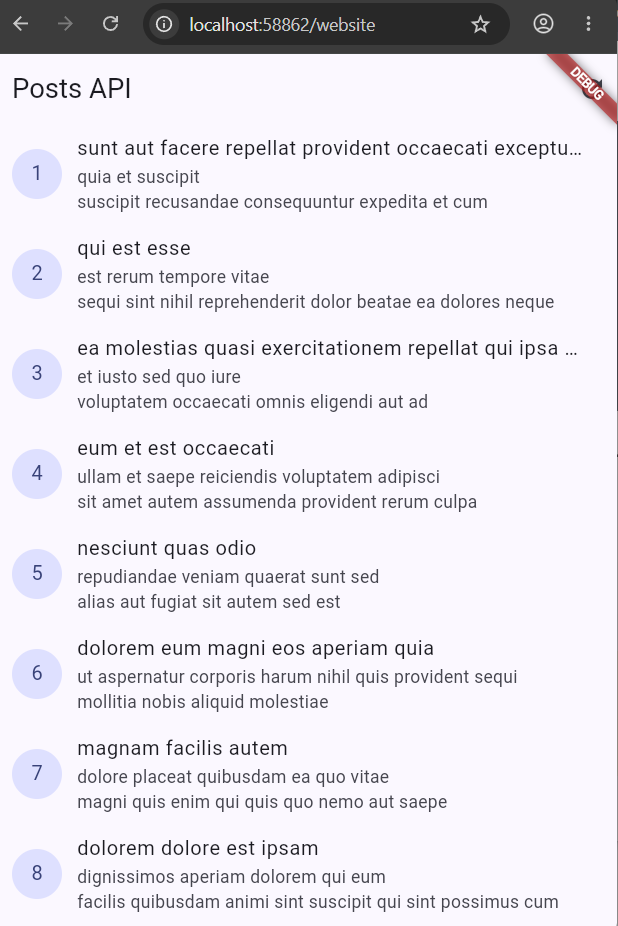
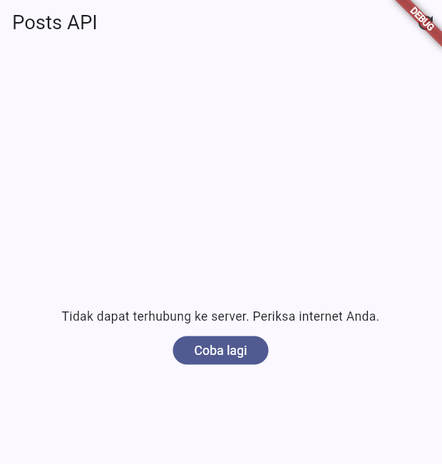
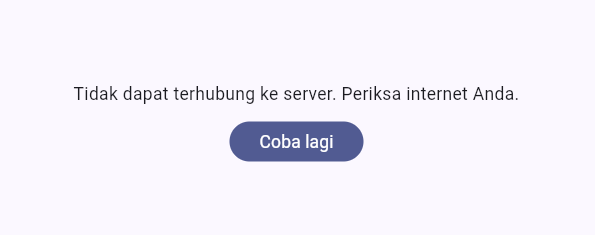
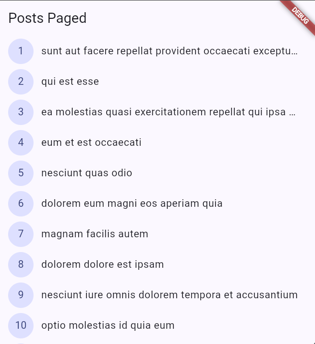
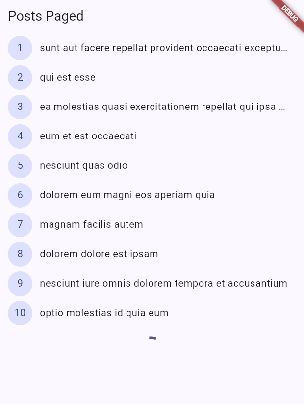
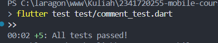
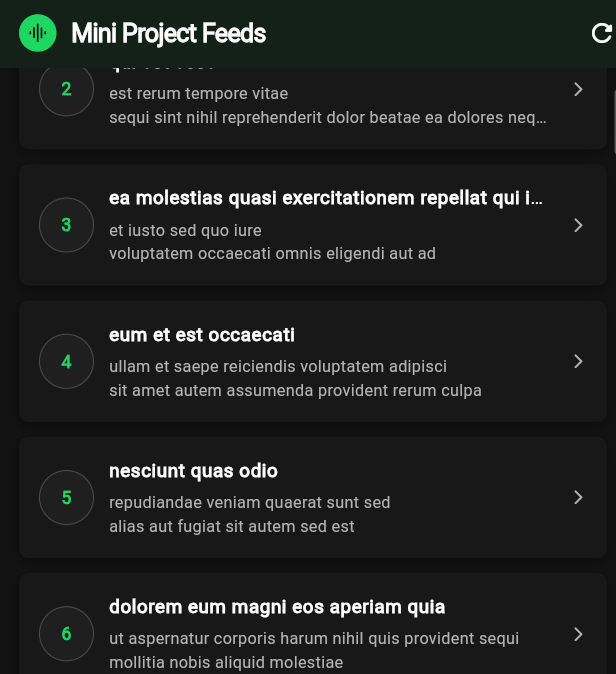

# Laporan Praktikum Minggu 4: Networking & REST API


| Data Mahasiswa     | Keterangan                           |
| :------------------- | :------------------------------------- |
| **Mata Kuliah**    | Pemrograman Mobile                   |
| **Dosen Pengampu** | Agung Nugroho Pramudhita, S.T., M.T. |
| **Nama Mahasiswa** | Nabhan Rizqi Julian Saputro          |
| **NIM**            | `2341720255`                         |
| **Kelas**          | TI - 3F                              |
| **Minggu / Modul** | Minggu 04 - Networking & REST API    |

---

## Praktikum 2: Provider dan Error Handling

### 1. Skenario 1: Internet Normal

- **Deskripsi**: Menjalankan aplikasi dengan koneksi internet aktif, menampilkan indikator *loading*, lalu berhasil memuat daftar 100 data post dari REST API.
- **Bukti Screenshot**:

  

---

### 2. Skenario 2: Mode Pesawat / Tanpa Internet (Offline) & Coba Lagi

- **Deskripsi**: Menyalakan mode pesawat, menekan tombol refresh, sistem menangkap error dan menampilkan pesan ramah serta tombol **Coba lagi**. Setelah internet diaktifkan kembali dan tombol **Coba lagi** ditekan, data berhasil dimuat kembali.
- **Bukti Screenshot**:

  

---

### 3. Skenario 3: Base URL Salah (Connection Error)

- **Deskripsi**: Mengubah `baseUrl` menjadi URL yang salah pada konfigurasi Dio, mengamati penanganan pesan error koneksi pada UI, kemudian mengembalikan URL ke nilai semula.
- **Bukti Screenshot**:

  

---

## Praktikum 3: Pagination Dasar (Infinite Scroll)

### 1. Bukti Halaman Pertama (Page 1)

- **Deskripsi**: Menampilkan 10 item awal pertama (`_page=1&_limit=10`) saat aplikasi pertama kali dimuat.
- **Bukti Screenshot**:

  

---

### 2. Bukti Infinite Scroll (Loading More & Data Bertambah)

- **Deskripsi**: Saat layar di-scroll mendekati batas bawah, indikator loading kecil (*CircularProgressIndicator*) muncul di bawah list, kemudian 10 data berikutnya bertambah secara mulus tanpa melakukan reload penuh ke seluruh layar.
- **Bukti Screenshot**:

  

---

## AI Challenge: Repository Layer & Verification Checklist

### 1. Prompt AI yang Digunakan

```text
Buatkan repository layer Flutter untuk endpoint GET /comments?postId={id}
dari JSONPlaceholder menggunakan Dio + flutter_riverpod.
Requirements:
- Model Comment dengan fromJson aman null (postId, id, name, email, body).
- CommentRepository dengan method fetchComments(postId) + timeout 10 detik.
- AsyncNotifierProvider dengan penanganan error otomatis (AsyncError)
  dan fungsi pesan error ramah pengguna untuk timeout, connection error, 404, dan 500.
- Satu unit test untuk fromJson dengan field yang hilang.
Jelaskan setiap bagian kode dalam komentar.
```

---

### 2. Tabel AI Verification Checklist


| No | Poin Verifikasi Checklist                |  Status  | Catatan Temuan & Keputusan Teknis                                                                                                   |
| :--- | :----------------------------------------- | :--------: | :------------------------------------------------------------------------------------------------------------------------------------ |
| 1  | **UI Memanggil Dio Langsung?**           | ✅ Lolos | UI dilarang memanggil Dio secara langsung. Akses jaringan diisolasi penuh melalui`CommentRepository`.                               |
| 2  | **`fromJson` Aman Null?**                | ✅ Lolos | Parsing menggunakan casting aman`(json['postId'] as num?)?.toInt() ?? 0` dan fallback `''`, bebas crash dari tipe data tak terduga. |
| 3  | **Pemetaan `DioExceptionType` Lengkap?** | ✅ Lolos | Menangani timeout (send/receive/connect),`connectionError`, HTTP 404, serta HTTP 500 melalui fungsi `commentErrorMessage`.          |
| 4  | **Pemusatan `baseUrl` dan Timeout?**     | ✅ Lolos | Menggunakan instance`dioProvider` terpusat dari `api_client.dart` dengan tambahan batas waktu 10 detik di repository.               |
| 5  | **Pengujian Field Hilang & Edge Case?**  | ✅ Lolos | Unit test menguji field hilang/null serta edge-case tipe data pecahan (`double` ke `int`) dan pemetaan pesan error.                 |
| 6  | **Hasil Analisis & Testing Otomatis?**   | ✅ Lolos | Seluruh 5 unit test pada`test/comment_test.dart` lulus 100% tanpa error (`All tests passed`).                                       |

---

### 3. Bukti Pengujian Unit Test AI Challenge

- **Deskripsi**: Hasil eksekusi unit test `flutter test test/comment_test.dart` yang menguji integritas model dan pemetaan pesan error.
- **Bukti Screenshot / Log Output**:

  

---

## Refactoring dan Testing

### 1. Refactoring Komponen UI (Modular Widgets)

- **Deskripsi**: Memisahkan antarmuka `PostListPage` menjadi modul widget terisolasi di folder `lib/widgets/`:
  - `PostItemTile`: Komponen item baris list post.
  - `PostListLoadingView`: Komponen indikator loading.
  - `PostListErrorView`: Komponen tampilan error beserta tombol retry.
  - `PostListEmptyView`: Komponen data kosong.
- **Tujuan**: Meningkatkan *reusability*, mempermudah *maintenance*, dan menjaga kode UI tetap bersih (*Clean Code*).

---

### 2. Testing Provider & Repository (Fake/Mock Repository)

- **Deskripsi**: Menjalankan pengujian otomatis unit test di `test/post_test.dart` menggunakan `FakePostRepository` dan helper `readPostsOnce` serta `readPostsErrorOnce`.
- **Hasil Pengujian**: Seluruh 6 unit test berhasil lulus 100% tanpa kendala jaringan sungguhan (*isolated testing*).
- **Bukti Screenshot / Output Terminal**:

  

---

## 8. Mini Project: Feeds REST API

### 1. Karakteristik & Desain UI

- **Visual Atmosphere**: Mengadopsi *content-first darkness* bertema near-black (`#121212`, `#181818`, `#1F1F1F`).
- **Brand Accent**: Menggunakan aksen hijau segar (`#1ED760`) untuk play/refresh icon, badge ID post, dan tombol aksi utama.
- **Pill Geometry**: Menerapkan rounded corners tactile 8px pada kartu post dan tombol berbentuk full-pill (`borderRadius: 9999px`) dengan gaya label uppercase bertrik spasi huruf (`letter-spacing: 1.4`).
- **Four UI States**:
  1. **Loading State**: `SpotifyLoadingView` dengan spinner hijau kontras.
  2. **Error State**: `SpotifyErrorView` dengan ikon semantic red (`#F3727F`) dan tombol pill "COBA LAGI".
  3. **Empty State**: `SpotifyEmptyView` dengan ikon library dan teks abu-abu perak (`#B3B3B3`).
  4. **Success State**: Daftar post dengan infinite scroll dan custom `RefreshIndicator`.

### 2. Bukti Screenshot Mini Project Feeds

- **Deskripsi**: Tampilan feed post dengan tema gelap imersif, infinite pagination, dan card elevated.
- **Bukti Screenshot**:

  

---

r## 💡 9. Jawaban Refleksi Praktikum

### 1. Mengapa UI dilarang memanggil Dio langsung? Apa yang rusak jika aturan ini dilanggar?

> **Jawaban**:UI dilarang memanggil Dio secara langsung demi mematuhi prinsip **Separation of Concerns (SoC)** dan **Dependency Inversion**:
>
> - **Kerapuhan Kode (Coupling Tinggi)**: Jika UI memanggil Dio langsung, komponen antarmuka menjadi terikat erat (*tightly coupled*) pada implementasi library jaringan tertentu. Jika suatu saat Dio diganti atau endpoint berubah, seluruh file halaman UI harus ikut diubah.
> - **Ketidakmampuan Menjalankan Unit Test Terisolasi**: UI yang memanggil Dio langsung tidak dapat diuji secara otomatis tanpa memicu request HTTP sungguhan (membutuhkan koneksi internet aktif dan server hidup).
> - **Bocornya Tanggung Jawab Error Handling**: Exception mentah seperti *SocketException* atau *HandshakeException* akan terekspos langsung ke lapisan presentasi, merusak kebersihan logika visual dan meningkatkan risiko crash aplikasi.

### 2. Kapan pagination client-side cukup, dan kapan harus mengandalkan pagination server (`_page`/`_limit`)?

> **Jawaban**:
>
> - **Pagination Client-Side Cukup**: Ketika total volume data dari server berukuran kecil dan tetap (misal: di bawah 50–100 item seperti daftar kategori, opsi pengaturan, atau daftar provinsi). Data dapat diunduh sekaligus pada awal aplikasi, kemudian pemfilteran atau pemecahan halaman dilakukan secara instan di memori perangkat tanpa latensi jaringan.
> - **Wajib Mengandalkan Pagination Server (`_page`/`_limit`)**: Ketika volume data berjumlah ratusan, ribuan, atau terus bertambah tanpa batas (seperti feed media sosial, katalog marketplace, log transaksi, atau daftar artikel). Mengunduh seluruh data sekaligus akan memboroskan kuota internet pengguna, memicu lonjakan penggunaan memori RAM (OOM), dan menyebabkan waktu tunggu *loading* awal menjadi sangat lambat.

### 3. Bagaimana exception repository berubah menjadi `AsyncError` tanpa `try/catch` di setiap widget? Kapan `try/catch` eksplisit tetap dibutuhkan?

> **Jawaban**:
>
> - **Mekanisme Otomatis**: Di Riverpod 3.x, method `build()` pada `AsyncNotifier` (atau callback pada `FutureProvider`) secara otomatis membungkus eksekusi `Future` ke dalam deklaratif guard. Ketika repository melempar exception (misalnya `DioException`), runtime Riverpod mencegat exception beserta stack trace-nya, lalu secara otomatis mengonversi state provider menjadi `AsyncError(error, stackTrace)`. Widget UI yang memanggil `ref.watch(provider).when(...)` cukup mendengarkan cabang `error:` tanpa perlu menulis blok `try/catch`.
> - **Kapan `try/catch` Eksplisit Tetap Dibutuhkan?**:
>   1. Pada **event handler interaktif / mutasi** (seperti tombol submit formulir, tombol hapus, atau method `refresh()`), di mana aksi dipicu oleh interaksi pengguna di luar siklus deklaratif `build()`.
>   2. Ketika ingin melakukan **tindakan sampingan (*side-effects*) spesifik**, seperti mencatat log lokal, menampilkan `SnackBar`, atau memetakan exception teknis ke domain error sebelum state diperbarui.

### 4. Bagian mana dari hasil AI yang Anda perbaiki, dan mengapa?

> **Jawaban**:Berdasarkan pengujian pada AI Challenge, beberapa bagian penting dari hasil awal AI yang diperbaiki meliputi:
>
> 1. **Peningkatan Ketahanan Null-Safety Model (`Comment.fromJson`)**:
>    - *Sebelumnya*: Kode awal AI menggunakan casting langsung `(json['postId'] as int)` yang rentan crash (*type cast exception*) jika API mengembalikan angka bertipe `double`, `num`, atau `null`.
>    - *Perbaikan*: Diubah menjadi `(json['postId'] as num?)?.toInt() ?? 0` serta menambahkan fallback string default `''` untuk mencegah crash pada respons yang tidak terduga.
> 2. **Pembaruan Arsitektur Provider ke Riverpod 3.x Modern**:
>    - *Sebelumnya*: AI menggunakan `StateProvider` yang sudah usang (*deprecated*) serta sintaks `FamilyAsyncNotifier` yang tidak kompatibel.
>    - *Perbaikan*: Direfaktor menggunakan `NotifierProvider<SelectedPostIdNotifier, int>` dan `AsyncNotifier<List<Comment>>` murni yang reaktif membaca `ref.watch()`.
> 3. **Penyempurnaan Pemetaan Pesan Error Jaringan**:
>    - *Perbaikan*: Memetakan status 404, error 500+, dan berbagai varian timeout ke dalam pesan ramah pengguna berbahasa Indonesia yang jelas dan dapat ditindaklanjuti (menampilkan tombol coba lagi).
