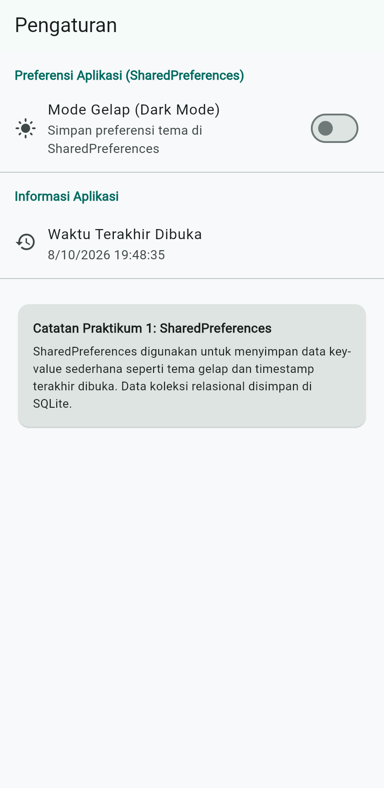
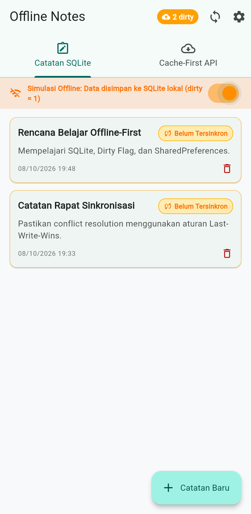
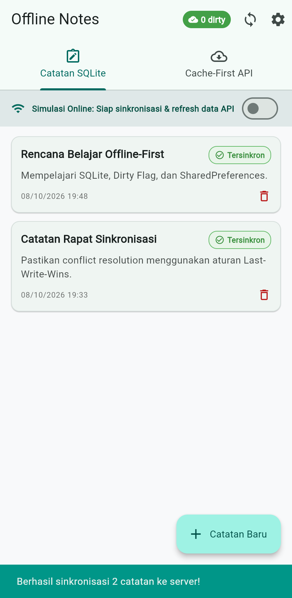
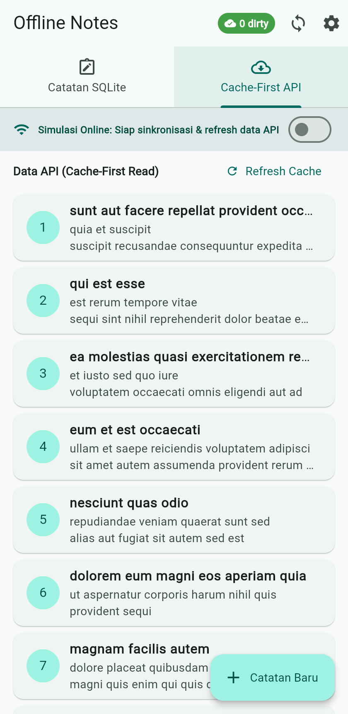
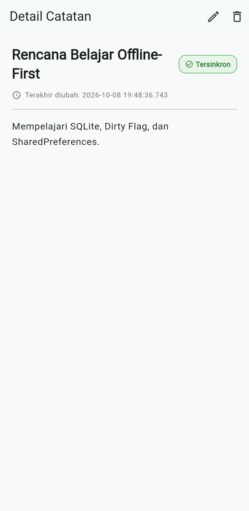
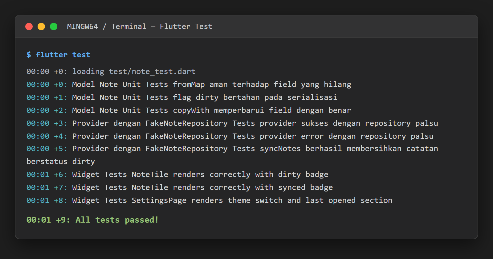

# Laporan Praktikum Minggu 5: Local Storage & Offline First

| Data Mahasiswa     | Keterangan                                |
| :------------------- | :------------------------------------------ |
| **Mata Kuliah**    | Pemrograman Mobile                        |
| **Dosen Pengampu** | Agung Nugroho Pramudhita, S.T., M.T.      |
| **Nama Mahasiswa** | Nabhan Rizqi Julian Saputro               |
| **NIM**            | `2341720255`                              |
| **Kelas**          | TI - 3F                                   |
| **Minggu / Modul** | Minggu 05 - Local Storage & Offline First |

---

## Praktikum 1: SharedPreferences (Preferensi Tema & Riwayat Buka)

### 1. Deskripsi Praktikum

- Mengimplementasikan `PrefsRepository` di [lib/data/prefs.dart](file:///c:/laragon/www/Kuliah/2341720255-mobile-course/_05_week_5_local_storage_offline_first/lib/data/prefs.dart) untuk mengelola data *key-value* sederhana secara terisolasi.
- Menggunakan `AsyncNotifierProvider` (`DarkModeNotifier`) pada [lib/pages/settings_page.dart](file:///c:/laragon/www/Kuliah/2341720255-mobile-course/_05_week_5_local_storage_offline_first/lib/pages/settings_page.dart) untuk menghubungkan toggle tema gelap/terang secara reaktif ke UI.
- Mencatat stempel waktu (`DateTime.now()`) saat aplikasi diluncurkan di [lib/main.dart](file:///c:/laragon/www/Kuliah/2341720255-mobile-course/_05_week_5_local_storage_offline_first/lib/main.dart) melalui method `markOpenedNow()` dan menampilkannya pada halaman Pengaturan.

### 2. Bukti Screenshot

---

## Praktikum 2: SQLite & Repository Catatan (CRUD Catatan Offline)

### 1. Deskripsi Praktikum

- Membuat entitas model [Note](file:///c:/laragon/www/Kuliah/2341720255-mobile-course/_05_week_5_local_storage_offline_first/lib/data/local/note.dart) dengan pemetaan `toMap()` dan `fromMap()` yang aman dari nilai null serta mendukung field penanda `dirty`.
- Mengonfigurasi database SQLite di [lib/data/local/db.dart](file:///c:/laragon/www/Kuliah/2341720255-mobile-course/_05_week_5_local_storage_offline_first/lib/data/local/db.dart) untuk membuat tabel `notes` dan `cached_posts`.
- Menerapkan arsitektur Repository di [lib/data/repositories/note_repository.dart](file:///c:/laragon/www/Kuliah/2341720255-mobile-course/_05_week_5_local_storage_offline_first/lib/data/repositories/note_repository.dart) sebagai satu-satunya akses data. UI dilarang memanggil database secara langsung.
- Menyediakan UI daftar catatan lokal di [lib/pages/notes_page.dart](file:///c:/laragon/www/Kuliah/2341720255-mobile-course/_05_week_5_local_storage_offline_first/lib/pages/notes_page.dart) yang berfungsi penuh saat offline (tambah, baca, ubah, dan hapus catatan).

### 2. Bukti Screenshot

---

## Praktikum 3: Cache-First & Antrean Sinkronisasi (Offline-First)

### 1. Skenario 1: Sinkronisasi Catatan Kotor (`dirty`)

- Setiap catatan baru atau hasil editan saat offline ditandai dengan `dirty = true` (`dirty = 1` di database).
- Badge pada AppBar menampilkan indikator antrean sinkronisasi (misal: `2 dirty`).
- Saat tombol sinkronisasi ditekan (dalam status online), fungsi `syncNotes()` mengeksekusi simulasi upload ke server remote, memanggil `markAllSynced()`, dan mengubah status badge menjadi `0 dirty` serta badge pada kartu catatan menjadi **Tersinkron**.
- **Bukti Screenshot**:

  

---

### 2. Skenario 2: Cache-First Read API Posts

- Mengimplementasikan pola pembacaan **Cache-First**: data lokal dari tabel `cached_posts` langsung ditampilkan ke layar tanpa jeda loading, mencegah layar blank saat tidak ada internet.
- Pada background, jika koneksi internet aktif, sistem memanggil REST API JSONPlaceholder (`GET /posts`) via Dio, menyegarkan cache di SQLite, dan memperbarui tampilan UI secara otomatis.
- **Bukti Screenshot**:

  

---

## Refactoring Challenge

Sesuai instruksi penataan kode (Clean Architecture & Refactoring):

1. **Ekstraksi Widget `NoteTile`**: Baris item catatan dipisahkan ke dalam [lib/widgets/note_tile.dart](file:///c:/laragon/www/Kuliah/2341720255-mobile-course/_05_week_5_local_storage_offline_first/lib/widgets/note_tile.dart) lengkap dengan badge status sinkronisasi (`Belum Tersinkron` / `Tersinkron`), stempel waktu, dan aksi hapus.
2. **Pemisahan Modul Sinkronisasi**: Logika cache post dan fungsi `syncNotes()` dipindahkan ke [lib/data/sync.dart](file:///c:/laragon/www/Kuliah/2341720255-mobile-course/_05_week_5_local_storage_offline_first/lib/data/sync.dart) agar `NoteRepository` tetap murni menangani CRUD catatan lokal.
3. **Halaman Detail Catatan dengan Routing**: Disediakan [lib/pages/note_detail_page.dart](file:///c:/laragon/www/Kuliah/2341720255-mobile-course/_05_week_5_local_storage_offline_first/lib/pages/note_detail_page.dart) dengan rute `/note/:id`. Halaman ini membaca data langsung dari `NoteRepository.getNoteById(id)`, bukan mengandalkan state widget sebelumnya.

### Bukti Screenshot Detail Catatan

---

## AI Challenge: Storage Comparison & Verification Checklist

Dokumentasi lengkap tersimpan pada [docs/ai_storage_comparison.md](file:///c:/laragon/www/Kuliah/2341720255-mobile-course/_05_week_5_local_storage_offline_first/docs/ai_storage_comparison.md).

### 1. Tabel Perbandingan Local Storage

| Kriteria                 | SharedPreferences  | Hive (NoSQL)           | sqflite (SQLite)           | Drift (Reactive SQL)     |
| :------------------------- | :------------------- | :----------------------- | :--------------------------- | :------------------------- |
| **Model Data**           | Key-Value primitif | NoSQL Document / Box   | Relasional SQL (Tabel)     | Relasional Type-Safe     |
| **Kompleksitas Query**   | Sangat Rendah      | Rendah (Filter Memory) | Sangat Tinggi (SQL murni)  | Sangat Tinggi (Dart DSL) |
| **Kebutuhan Relasi**     | Tidak mendukung    | Tidak mendukung        | Penuh (Foreign Key)        | Penuh (Type-safe JOIN)   |
| **Reaktivitas (Stream)** | Manual Notifier    | Bawaan`watch()` Box    | Via Riverpod Notifier      | Bawaan Stream Query      |
| **Type-Safety**          | Primitif runtime   | Butuh TypeAdapter      | Mapping manual (`fromMap`) | Sangat tinggi (Code-Gen) |
| **Ukuran Boilerplate**   | Sangat Kecil       | Sedang                 | Sedang                     | Tinggi (`build_runner`)  |
| **Testing**              | Sangat Mudah       | Sedang                 | Sangat Mudah (Fake Repo)   | Sedang                   |

### 2. Tabel AI Verification Checklist

| No | Poin Verifikasi Checklist                                |   Status   | Catatan Temuan & Keputusan Teknis                                                                                                                              |
| :--- | :--------------------------------------------------------- | :----------: | :--------------------------------------------------------------------------------------------------------------------------------------------------------------- |
| 1  | **Apakah AI menempatkan catatan di SharedPreferences?**  | ❌ Ditolak | Ditolak tegas. SharedPreferences hanya untuk data primitif kecil. Menyimpan list JSON catatan di sana merusak performa I/O dan tidak mendukung query/indexing. |
| 2  | **Apakah skema AI mendukung antrean sync (dirty flag)?** |  ✅ Lolos  | Skema SQLite menyertakan kolom`dirty INTEGER` dan `updated_at TEXT` untuk antrean sinkronisasi offline serta resolusi konflik *Last-Write-Wins*.               |
| 3  | **Apakah klaim "real-time" didukung stream?**            |  ✅ Lolos  | Reaktivitas dikelola bersih menggunakan Riverpod`AsyncNotifier` dan invalidasi state terpusat.                                                                 |
| 4  | **Apakah estimasi boilerplate AI masuk akal?**           |  ✅ Lolos  | Drift membutuhkan proses code-gen berat, sedangkan`sqflite` memberikan keseimbangan kontrol dan efisiensi yang optimal.                                        |
| 5  | **Keputusan Final Arsitektur**                           |  ✅ Lolos  | **SharedPreferences** untuk preferensi tema dan riwayat buka; **sqflite** untuk data catatan dan cache respons jaringan.                                       |

---

## Testing & Quality Assurance

Pengujian unit dan widget diimplementasikan pada:

- [test/note_test.dart](file:///c:/laragon/www/Kuliah/2341720255-mobile-course/_05_week_5_local_storage_offline_first/test/note_test.dart): Menguji serialisasi aman null, persistensi flag `dirty`, pengujian provider sukses & error dengan `FakeNoteRepository`, serta verifikasi pembersihan flag pada `syncNotes`.
- [test/widget_test.dart](file:///c:/laragon/www/Kuliah/2341720255-mobile-course/_05_week_5_local_storage_offline_first/test/widget_test.dart): Menguji rendering badge `NoteTile` dan komponen halaman `SettingsPage`.

### Hasil Eksekusi Pengujian Otomatis

Semua 9 pengujian lulus 100% tanpa error (`flutter test`):

---

## Jawaban Pertanyaan Refleksi

### 1. Mengapa daftar catatan tidak boleh disimpan di SharedPreferences? Apa yang rusak jika aturan ini dilanggar?

> SharedPreferences dirancang hanya untuk key-value data primitif kecil (seperti tema atau token). Menyimpan koleksi catatan di sana memaksa seluruh list diubah menjadi satu string JSON raksasa. Jika aturan ini dilanggar:
>
> - **Performa I/O lambat:** Setiap menambah/mengedit satu catatan, seluruh file preferensi harus dibaca dan ditulis ulang ke disk.
> - **Tidak ada fitur query:** Tidak bisa melakukan pencarian kata kunci, pengurutan, maupun pagination di tingkat database.
> - **Rawan korupsi data:** Jika aplikasi terhenti saat menulis string JSON yang besar, seluruh catatan pengguna bisa rusak sekaligus.

---

### 2. Kapan cache-first cukup, dan kapan Anda membutuhkan strategi lain (misalnya network-first)?

> - **Cache-first cukup:** Pada data bacaan yang jarang berubah atau data referensi statis (seperti daftar artikel, profil pengguna, atau catatan pribadi). Tujuannya agar aplikasi instan terbuka tanpa menunggu jaringan dan bebas blank screen.
> - **Network-first dibutuhkan:** Pada data yang menuntut akurasi real-time dan nilai kritis, seperti saldo rekening, kurs mata uang, harga saham, atau stok tiket/barang. Data lama (stale data) pada skenario ini berbahaya jika ditampilkan sebagai acuan transaksi.

---

### 3. Bagaimana dirty flag berubah menjadi antrean sync tanpa memblokir UI? Kapan antrean terpisah (tabel outbox) menjadi perlu?

> - **Tanpa memblokir UI:** Operasi tulis ke database lokal langsung mengembalikan kontrol ke antarmuka pengguna dalam hitungan milidetik dengan menandai `dirty = 1`. Proses sinkronisasi ke server dijalankan secara asinkron di latar belakang (background worker/timer). UI hanya memantau jumlah item kotor melalui provider reaktif.
> - **Tabel outbox diperlukan:** Ketika operasi offline melibatkan transaksi multi-tahap atau aksi beragam (seperti urutan *Create*, *Update*, *Delete*, *Upload File*). Tabel outbox mencatat riwayat urutan operasi secara kronologis (log event) agar proses replay ke server terjadi sesuai urutan waktu tanpa kehilangan konteks aksi.

---

### 4. Bagian mana dari rekomendasi AI yang Anda tolak, dan mengapa?

> - **Menolak Drift:** Karena Drift membutuhkan dependensi `build_runner` yang menambah waktu kompilasi dan kompleksitas boilerplate yang berlebihan untuk kebutuhan skema sederhana.
> - **Menolak penyimpanan list di SharedPreferences/Single JSON:** Menolak mentah-mentah ide menaruh koleksi catatan dalam format JSON string karena tidak memiliki kemampuan indexing dan parsial mutasi.
> - **Pilihan yang diambil:** Kombinasi **SharedPreferences** untuk pengaturan UI sederhana dan **sqflite** untuk persistensi relasional lokal karena memberikan kontrol penuh, performa stabil, dan kemudahan pengujian dengan injeksi `FakeNoteRepository`.
